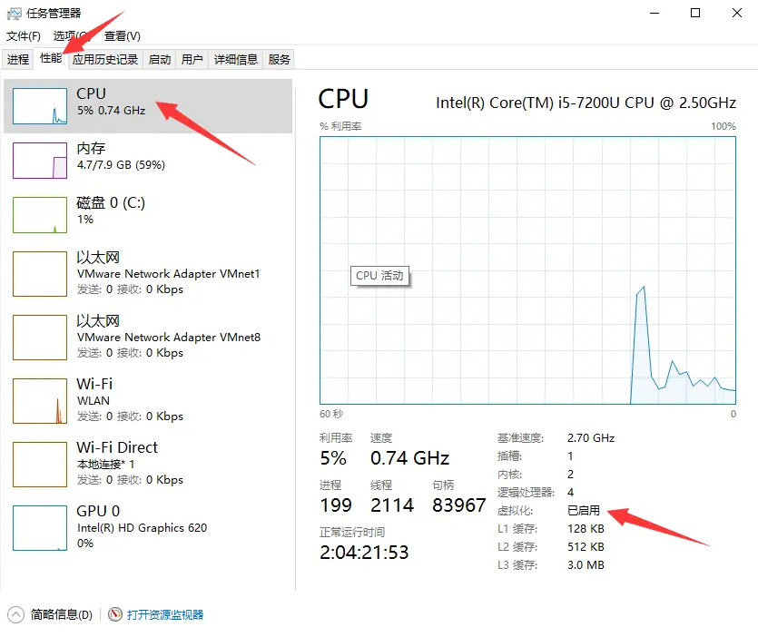
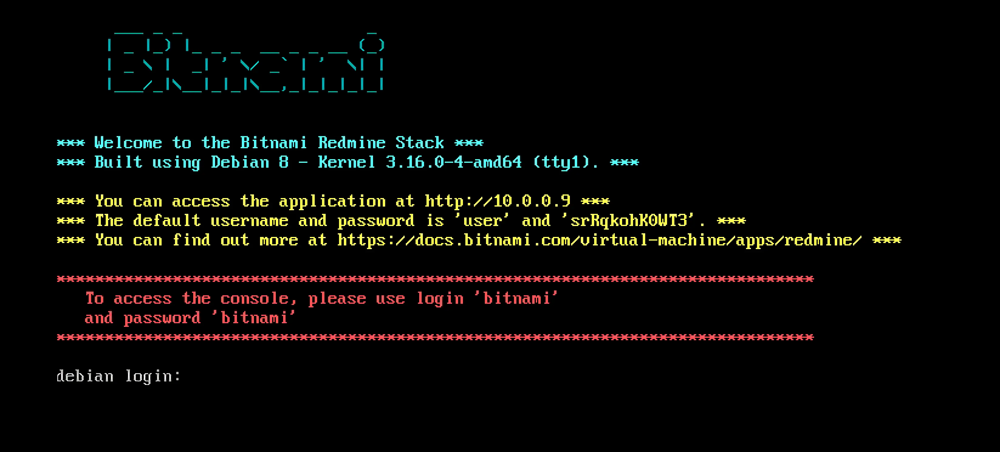

# 第 3 章：项目管理实战

## 浏览 redmine 官网

- 访问 [redmine 官网](http://www.redmine.org/)，回答以下问题
- redmine 项目目前总共有多少 bug，多少 bug 没有修复？
- redmine 项目最早的一个 bug 是什么时间提出的？谁提出的？主题是什么？这个 bug 最终是由谁修复的？什么时间修复的？
- 1.0.0（RC）版本中总共有多少个 bug？这些 bug 分那些类？每个类别下面的 bug 有多少个？
- redmine 用的 SCM 是什么系统？根据什么判断的？
- 把上述题目的答案，提交到[课程 redmine 网站](http://39.104.115.100/)，自己参与的项目中
- 问题的跟踪类型是：支持
- 问题的主题是：redmine 官网资料收集
- 问题的描述，参考：[redmine 官网资料收集](http://www.hostedredmine.com/issues/887915)

## 点亮 redmine 头像

- 在 [hostedredmine 网站](http://www.hostedredmine.com/)上注册账户
- 在 [Gravatar 网站](https://cn.gravatar.com/)点亮自己的头像
- 检查自己的 hostedredmine 账户，确保头像是点亮了
- 把 hostedredmine 中，自己的账户链接，提交到[课程 redmine 网站](http://39.104.115.100/)，自己参与的项目中
- 问题的跟踪类型是：支持
- 问题的主题是：hostedredmine 账户链接
- 问题的描述，参考：[hostedredmine 账户链接](http://www.hostedredmine.com/issues/887916)

## 项目团队管理

- 找不少于四人，不多于七人，组成项目团队
- 给自己的项目团队命名
- 在[课程 redmine 网站](http://39.104.115.100/)，创建项目，项目名称为团队的名称
- 每个团队成员在[课程 redmine 网站](http://39.104.115.100/)，注册并激活账号
- 将团队成员加到团队项目中
- 团队成员中，一人为管理员角色，其余人为开发人员角色

## 提交 bug

- 学习 [MarkDown 语法](https://www.redmine.org/projects/redmine/wiki/SimplifiedChineseWikiFormatting)，中的标题语法、列表项语法和图片语法
- 在上个任务创建的项目中，提交一个 bug
- **注意**：bug 描述中，要有测试步骤，并显示图片
- 参考：[bug 模板](http://www.hostedredmine.com/issues/598989) 和 [一个具体的 bug](http://www.hostedredmine.com/issues/626704)

## 本地安装 redmine

- 下载 [VMware workstation](https://pc.qq.com/detail/0/detail_21600.html) 安装包（选择**普通下载**）
- 运行上一步下载的安装包，完成 VMware workstation 的安装
- 百度搜索 vmware workstation 的密钥
- win10 任务栏点右键，打开任务管理器窗口，确保 win10 的虚拟化已经启用，参考下图

  

- 如果 win10 虚拟化没有启用，重启电脑（长按 F2 或 F10）进入 BIOS 界面，设置 BIOS 开启虚拟化，参考[这个文章](http://www.jb51.net/diannaojichu/304437.html)
- 打开 bitnami 的 redmine 虚拟机[下载页面](https://bitnami.com/stack/redmine/virtual-machine)
- 点击 `Download .OVA format` 下载按钮
- 用 vmware 虚拟机软件，打开上一步下载的 redmine ova 文件
- 上述操作参考[教学视频](https://www.bilibili.com/video/bv1iy4y1y7hm)（**只看前 8 分钟的内容**）
- 启动 redmine 虚拟机，虚拟机启动之后，**等待几分钟**，会出现如下画面
- 注意，画面中的 IP 地址和密码信息不会相同

  

- 用浏览器访问 vmware 窗口中提示的网址（上图，黄色文字第一行），输入用户名 user，密码（上图，黄色文字第二行），登录 redmine
- 在本机的 redmine 网站上，为自己团队创建账户
- 在本机的 redmine 网站上，创建自己团队名称的项目
- 把自己团队每个人的账户，加入到上一步创建的项目中
- 分配角色，一个管理员，其余为开发人员

## 启用虚拟机的 SSH 服务

- 上一个任务的 redmine linux 虚拟机窗口
- 登录 redmine linux 虚拟机
- 用户名：bitnami，密码：bitnami
- 登录后，提示修改密码，Ctrl + C 可以不修改密码，愿意修改密码，一定要记住自己改后的密码
- 出现 linux 命令提示符，`bitnami@debian:~$`，执行下面的操作：

```bash
cd /etc/ssh
sudo rm -rf sshd_not_to_be_run
sudo systemctl enable ssh
sudo systemctl start ssh
sudo systemctl status ssh             // 确保 ssh 服务的状态是 active (running)
```

## XShell 连接 redmine linux 虚拟机

- 下载 [XShell](https://www.netsarang.com/zh/free-for-home-school/)
- 运行上一步下载的安装包，完成 XShell 的安装
- 启动 XShell 软件，新建会话
- 新建会话对话框中，输入会话名称，和主机 IP
- 注意，主机 IP 是 redmine 虚拟机的 IP 地址，见上图，redmine 虚拟机登录界面，第一行黄色文字
- 点【确定】按钮，创建会话
- 选中刚创建的会话，点【连接】按钮，连接到 redmine 虚拟机
- 输入用户名，bitnami，勾选【记住用户名】
- 输入密码，bitnami（如果修改了密码，输入自己改后的密码）
- 出现 linux 命令行提示符，`bitnami@debian:~$`

## 操作 MySQL

- 在 XShell 窗口，连接到 redmine linux 虚拟机，出现 linux 命令行提示符，`bitnami@debian:~$`
- 输入命令，`mysql -u root -p`，进入 mysql 控制台
- 输入密码，见 redmine 虚拟机登录界面，第二行黄色文字
- 注意：输入密码时，界面不会显示任何信息，要确保密码输入正确，输完打回车
- 正常境况，会看到 mysql 命令行提示符，`mysql> `
- 输入 SQL 语句，`show databases;`，查看 mysql 数据库中有哪些数据库
- 输入 SQL 语句，`use bitnami_redmine;`，使用 bitnami_redmine 数据库
- 输入 SQL 语句，`show tables;`，显示 bitnami_redmine 数据库中的表
- 输入 SQL 语句，`describe users;`，显示 users 表的结构
- 输入 SQL 语句，`select id, login, firstname, lastname from users;`，查询 users 表中的数据
- 把上面查询语句执行的结果，截图，保存成图片
- 将图片提交到[课程 redmine 网站](http://39.104.115.100/)，自己团队的项目中
- 问题的跟踪类型是：支持
- 问题的主题是：MySQL 操作截图
- 问题的描述是：[MySQL 操作截图]
- **注意**：确保问题描述中的图片，可以直接看到，另外，截图的区域，要截取 XShell 的完整窗口
- 输入下面的 SQL 语句，做连表查询

```sql
select users.id, login, firstname, lastname, address
from users
join email_addresses
on users.id = email_addresses.user_id;
```
- 输入命令，`exit` 退出 mysql 控制台
